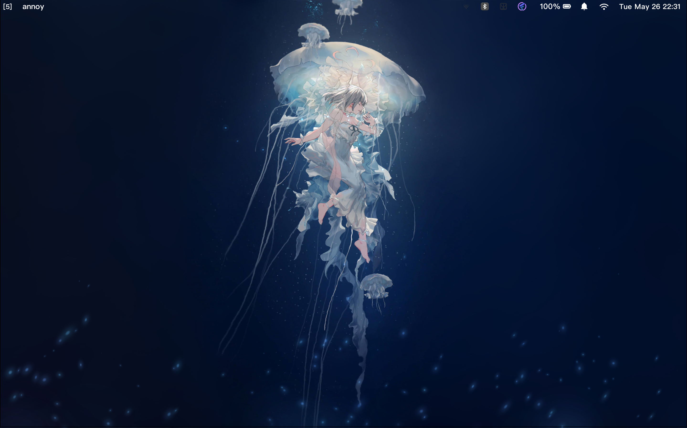
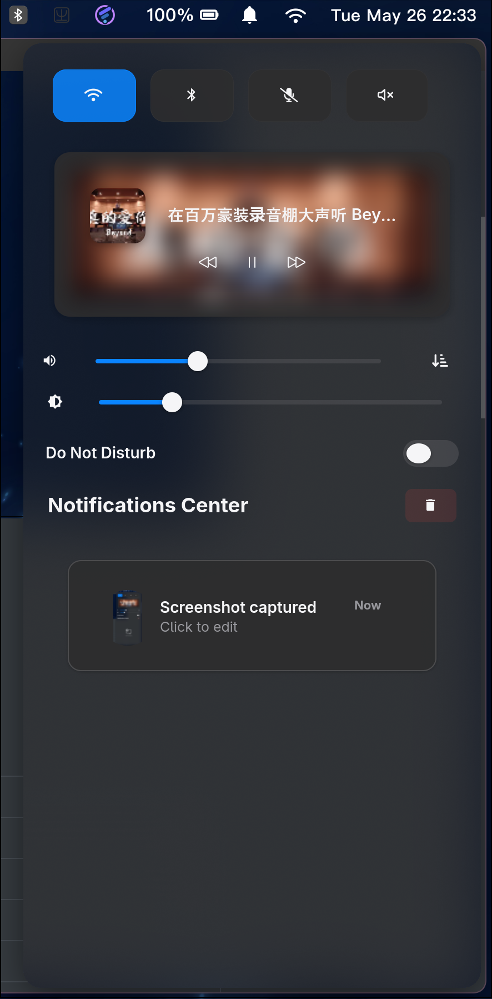
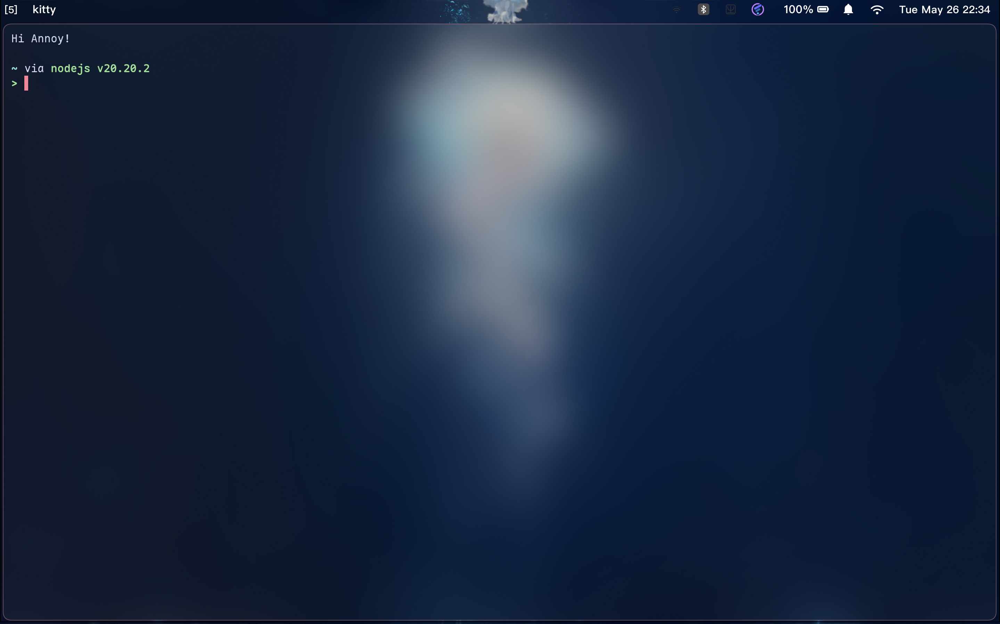

# Hyprland Dotfiles


注意：在使用此仓库的配置文件时，建议先备份自己的配置文件，避免出现配置丢失的情况,配置文件中的大多数配置也是借鉴别人的开源仓库,再次感谢其他作者的开源项目！！！。

### 截图

#### 桌面截图

#### 


#### swaync截图

#### 


#### kitty程序截图




## Overview

| Category        | Tool        |
| --------------- | :---------- |
| WM / Compositor | Hyprland    |
| Status Bar      | Waybar      |
| Launcher        | Rofi        |
| Terminal        | Ghostty / Kitty |
| Shell           | Fish/zsh    |
| Editor          | Neovim      |
| Notifications   | SwayNC      |
| Lock Screen     | Hyprlock    |
| Idle Manager    | Hypridle    |
| Prompt          | Starship    |
| Multiplexer     | Tmux        |
| Input Method    | Fcitx5      |

## File Structure

```
~/.config/
├── hypr/                  # Hyprland WM configs (Lua-based)
│   ├── hyprland.lua       # Entry point
│   ├── monitor.lua        # Monitor settings
│   ├── environment.lua    # Env vars (XCURSOR_SIZE=24)
│   ├── start.lua          # Startup execs
│   ├── general.lua        # General, decoration, input, misc, gestures
│   ├── animation.lua      # Custom bezier curves & animation rules
│   ├── binds.lua          # ALL keybinds
│   ├── rule.lua           # Window/layer rules
│   ├── plugins.lua        # Hyprspace setup
│   ├── hypridle.conf      # Idle daemon config
│   ├── hyprlock.conf      # Lock screen config
│   └── Hyprspace/         # Workspace overview plugin
├── waybar/
│   ├── config.jsonc       # Waybar module layout
│   ├── style.css          # Waybar styling
│   └── scripts/
│       └── current-workspace.sh
├── kitty/
│   └── kitty.conf         # Kitty terminal config
├── ghostty/
│   └── config             # Ghostty terminal config (with custom shaders)
├── rofi/
│   ├── launcher/
│   │   ├── config.rasi    # Launcher config (drun mode)
│   │   └── theme.rasi     # Launcher theme
│   ├── theme.rasi         # Generated theme backup
│   └── script/            # Custom scripts (power-menu, wallpaper-picker)
├── fish/
│   └── config.fish        # Fish shell config (abbreviations, fzf, functions)
├── nvim/
│   └── init.lua           # Neovim bootstrap (Lazy.nvim)
├── tmux/
│   └── tmux.conf          # Tmux config (Catppuccin theme, custom status)
├── starship/
│   └── starship.toml      # Starship prompt config
├── swaync/
│   ├── config.json        # SwayNC config (widgets, buttons grid)
│   ├── style.css          # SwayNC styling
│   └── colors/
│       └── color.css      # Color palette (dark theme)
├── mako/
│   └── config             # Mako notification config
└── fcitx5/
    └── ...                # Input method config
```

### 说明


目前使用hyprlandwm+waybar+swaync+rofi的使用模式，hyprland用来管理窗口，布局为master布局，waybar用来展示状态栏的一些工作状态，比较简洁，swaync是控制中心和信息接收，rofi用来桌面程序启动和电源会话管理，awww程序用来管理切换壁纸

## Installation

1. Clone this repo to `~/.config/`:
   ```bash
   git clone https://github.com/Ann0y/hyprland-dotfiles.git
   cp -r hyprland-dotfiles/.config/* ~/.config/
   ```

2. Required packages (Arch):
   ```bash
   sudo pacman -S hyprland waybar rofi kitty ghostty fish neovim tmux \
     mako swaync hyprlock hypridle starship fcitx5 nautilus \
     brightnessctl playerctl cliphist wl-clipboard
   ```

3. Install Hyprspace plugin:
   ```bash
   hyprpm add https://github.com/KZDKM/Hyprspace
   ```

4. Install Tmux plugins: launch `tmux` and press `C-a I`

5. Launch Neovim to trigger Lazy.nvim bootstrap
